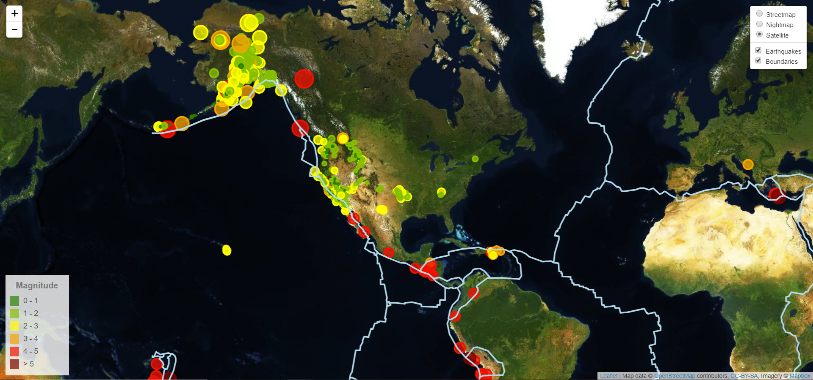

# Week 17: Leaflet-Challenge
By A. Rijpkema 2/16/2020

You've got to love graphics! Adding the creation of maps to our list of assignments, opened up the door to so many more posibilities. This week we had to use leaflet.js and its geojson method, to plot earthquakes by scale on a map with interactive layers (street map, a night map and a satellite map). I also added the optional layer of platonic bounderies. 

The data is retrieved from  and will in this particular case retrieve all earthquakes from the past week worldwide.

The result:
 
